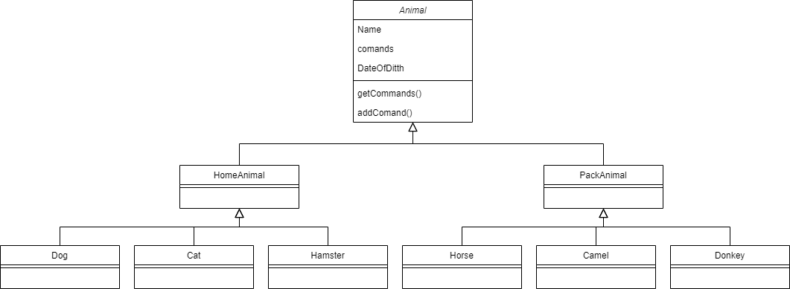

1. Используя команду cat в терминале операционной системы Linux, создать
два файла Домашние животные (заполнив файл собаками, кошками,
хомяками) и Вьючные животными заполнив файл Лошадьми, верблюдами и
ослы), а затем объединить их. Просмотреть содержимое созданного файла.
Переименовать файл, дав ему новое имя (Друзья человека).

```
cat > HomeAnimal
Собака Шарик
Кошка Джесси
Хомяк Хома
Собака Мухтар

cat > PackAnimal
Лошадь Мурка
Верблюд Вася
Осел Иа

cat HomeAnimal PackAnimal > FriendPeople
```
Просмотр содержимого файла

```
cat FriendPeople
```


2. Создать директорию, переместить файл туда.

```
mkdir Folder

mv FriendPeople Folder/
```

3. Подключить дополнительный репозиторий MySQL. Установить любой пакет
из этого репозитория.

Скачиваем конфигуратор mysql:

```
wget https://dev.mysql.com/get/mysql-apt-config_0.8.24-1_all.deb
```

Устанавливаем компоненты mysql с помощью конфигуратора:

```
sudo dpkg -i mysql-apt-config_0.8.24-1_all.deb
```

В процессе установки жмем Ок, чтобы выполнить полную установку

Обновляем информацию о пакетах и видим подключенный репозиторий mysql:

```
sudo apt update
```

Устанавливаем mysql-server:

```
sudo apt install mysql-server
```

Проверяем результат установки:

```
systemctl status mysql
```

4. Установить и удалить deb-пакет с помощью dpkg.

Скачиваем пакет для установки:

```
wget https://dev.mysql.com/get/Downloads/Connector-J/mysql-connector-j_8.0.32-1ubuntu22.04_all.deb
```

Устанавливаем пакет mysql-connector-j_8.0.32-1ubuntu22.04_all.deb:

```
sudo dpkg - i mysql-connector-j_8.0.32-1ubuntu22.04_all.deb
```

Удаляем пакет и его сопутствующие пакеты:

```
sudo dpkg -r mysql-connector-j

sudo apt-get autoremove
```

5. Выложить историю команд в терминале ubuntu

```
history
```
815  clear\\
816  pwd\
  817  mkdir FinalAttestation\
  818  cd FinalAttestation/\
  819  cat > HomeAnimal\
  820  cat PackAnimal\
  821  cat > PackAnimal\
  822  cat HomeAnimal PackAnimal > FriendPeople\
  823  ls\
  824  cat FriendPeople\
  825  mkdir Folder\
  826  cd Folder/\
  827  cd ..\
  828  mv FriendPeople Folder/\
  829  cd Folder/\
  830  ls\
  831  cat FriendPeople\
  832  cd ..\
  833  wget https://dev.mysql.com/get/mysql-apt-config_0.8.24-1_all.deb\
  834  cd ..\
  835  ls\
  836  cd Загрузки/\
  837  ды\
  838  ls\
  839  ls -a\
  840  sudo dpkg -i mysql-apt-config_0.8.24-1_all.deb\
  841  sudo kill -9 8714\
  842  sudo dpkg -i mysql-apt-config_0.8.24-1_all.deb\
  843  wget https://dev.mysql.com/get/mysql-apt-config_0.8.24-1_all.deb\
  844  sudo dpkg -i mysql-apt-config_0.8.24-1_all.deb\
  845  cd ..\
  846  sudo apt update\
  847  sudo apt install mysql-server\
  848  systemctl status mysql\
  849  sudo dpkg nginx\
  850  sudo dpkg -i nginx\
  851  sudo dpkg -i postgresql-12.4-dbserver.deb\
  852  wget https://example.com/postgresql-12.7-amd64.deb\
  853  sudo wget https://example.com/postgresql-12.7-amd64.deb\
  854  wget https://www.postgresql.org/.../postgre.deb\
  855  wget https://apt.postgresql.org/pub/repos/apt/pool/main/p/postgresql-12/postgresql-12_12.\5-1.pgdg20.04+1_amd64.deb
  856  wget https://dev.mysql.com/get/Downloads/Connector-J/mysql-connector-j_8.0.32-1ubuntu22.\04_all.deb
  857  sudo dpkg - i mysql-connector-j_8.0.32-1ubuntu22.04_all.deb\
  858  sudo dpkg -r mysql-connector-j\
  859  sudo dpkg - i mysql-connector-j_8.0.32-1ubuntu22.04_all.deb\
  860  ls\
  861  history\

6. Нарисовать диаграмму, в которой есть класс родительский класс, домашние\
животные и вьючные животные, в составы которых в случае домашних
животных войдут классы: собаки, кошки, хомяки, а в класс вьючные животные
войдут: Лошади, верблюды и ослы).



7. В подключенном MySQL репозитории создать базу данных “Друзья
человека”
8. Создать таблицы с иерархией из диаграммы в БД
9. Заполнить низкоуровневые таблицы именами(животных), командами
которые они выполняют и датами рождения
10. Удалив из таблицы верблюдов, т.к. верблюдов решили перевезти в другой
питомник на зимовку. Объединить таблицы лошади, и ослы в одну таблицу.
11. Создать новую таблицу “молодые животные” в которую попадут все
животные старше 1 года, но младше 3 лет и в отдельном столбце с точностью
до месяца подсчитать возраст животных в новой таблице
12. Объединить все таблицы в одну, при этом сохраняя поля, указывающие на
прошлую принадлежность к старым таблицам.
[Скрипты выполнения пунктов 7 - 12](Scripts_7-12.sql)
13. Создать класс с Инкапсуляцией методов и наследованием по диаграмме.

14. Написать программу, имитирующую работу реестра домашних животных.
В программе должен быть реализован следующий функционал:
- 14.1 Завести новое животное
- 14.2 определять животное в правильный класс
- 14.3 увидеть список команд, которое выполняет животное
- 14.4 обучить животное новым командам
- 14.5 Реализовать навигацию по меню

15. Создайте класс Счетчик, у которого есть метод add(), увеличивающий̆
значение внутренней̆int переменной̆на 1 при нажатие “Завести новое
животное” Сделайте так, чтобы с объектом такого типа можно было работать в
блоке try-with-resources. Нужно бросить исключение, если работа с объектом
типа счетчик была не в ресурсном try и/или ресурс остался открыт. Значение
считать в ресурсе try, если при заведения животного заполнены все поля.

Приложение по пунктам 13-15 хранится в папке App